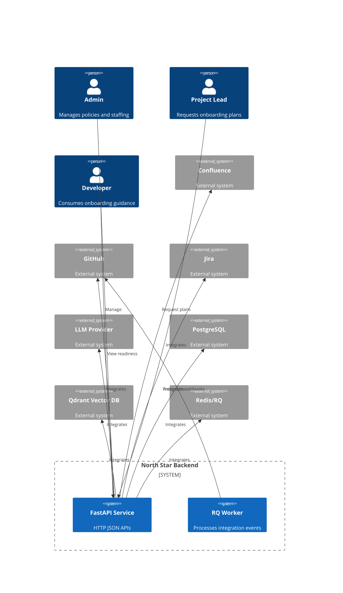

```mermaid
C4Context
    Person(admin, "Admin", "Manages policies and staffing")
    Person(project_lead, "Project Lead", "Requests onboarding plans")
    Person(developer, "Developer", "Consumes onboarding guidance")
    System_Boundary(ns, "North Star Backend") {
        System(api, "FastAPI Service", "HTTP JSON APIs")
        System(worker, "RQ Worker", "Processes integration events")
    }
    System_Ext(ext_confluence, "Confluence", "External system")
    System_Ext(ext_github, "GitHub", "External system")
    System_Ext(ext_jira, "Jira", "External system")
    System_Ext(ext_llm_provider, "LLM Provider", "External system")
    System_Ext(ext_postgresql, "PostgreSQL", "External system")
    System_Ext(ext_qdrant_vector_db, "Qdrant Vector DB", "External system")
    System_Ext(ext_redis_rq, "Redis/RQ", "External system")
    Rel(admin, api, "Manage")
    Rel(project_lead, api, "Request plans")
    Rel(developer, api, "View readiness")
    Rel(api, ext_confluence, "Integrates")
    Rel(api, ext_github, "Integrates")
    Rel(api, ext_jira, "Integrates")
    Rel(api, ext_llm_provider, "Integrates")
    Rel(api, ext_postgresql, "Integrates")
    Rel(api, ext_qdrant_vector_db, "Integrates")
    Rel(api, ext_redis_rq, "Integrates")
    Rel(worker, ext_github, "Processes webhooks")
```
