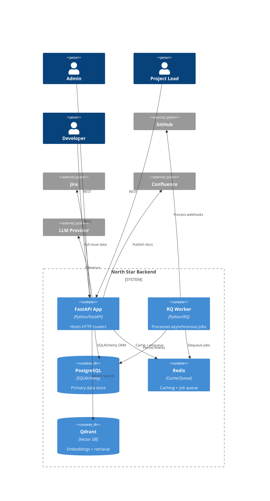

```mermaid
C4Container
    Person(admin, "Admin")
    Person(project_lead, "Project Lead")
    Person(developer, "Developer")
    System_Boundary(ns, "North Star Backend") {
        Container(api, "FastAPI App", "Python/FastAPI", "Hosts HTTP routers")
        Container(worker, "RQ Worker", "Python/RQ", "Processes asynchronous jobs")
        ContainerDb(postgres, "PostgreSQL", "SQLAlchemy", "Primary data store")
        Container(redis, "Redis", "Cache/Queue", "Caching + job queue")
        ContainerDb(qdrant, "Qdrant", "Vector DB", "Embeddings + retrieval")
    }
    System_Ext(github, "GitHub")
    System_Ext(jira, "Jira")
    System_Ext(confluence, "Confluence")
    System_Ext(llm, "LLM Provider")
    Rel(admin, api, "REST")
    Rel(project_lead, api, "REST")
    Rel(developer, api, "REST")
    Rel(api, postgres, "SQLAlchemy ORM")
    Rel(api, redis, "Cache + enqueue")
    Rel(api, qdrant, "Vector search")
    Rel(worker, redis, "Dequeue jobs")
    Rel(worker, postgres, "Persist events")
    Rel(worker, github, "Process webhooks")
    Rel(api, jira, "Pull issue data")
    Rel(api, confluence, "Publish docs")
    Rel(api, llm, "Inference")
```
