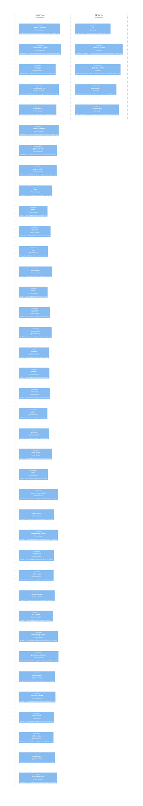

```mermaid
C4Component
    Container_Boundary(api, "FastAPI App") {
        Component(api_cerebras_planner, "cerebras_planner", "Python Module", "[Adapters](../../Src/backend/app/adapters/cerebras_planner.py)")
        Component(api_confluence_adapter, "confluence_adapter", "Python Module", "[Adapters](../../Src/backend/app/adapters/confluence_adapter.py)")
        Component(api_dense_bge, "dense_bge", "Python Module", "[Adapters](../../Src/backend/app/adapters/dense_bge.py)")
        Component(api_hybrid_retriever, "hybrid_retriever", "Python Module", "[Adapters](../../Src/backend/app/adapters/hybrid_retriever.py)")
        Component(api_jira_adapter, "jira_adapter", "Python Module", "[Adapters](../../Src/backend/app/adapters/jira_adapter.py)")
        Component(api_openai_planner, "openai_planner", "Python Module", "[Adapters](../../Src/backend/app/adapters/openai_planner.py)")
        Component(api_qdrant_client, "qdrant_client", "Python Module", "[Adapters](../../Src/backend/app/adapters/qdrant_client.py)")
        Component(api_sparse_hash, "sparse_hash", "Python Module", "[Adapters](../../Src/backend/app/adapters/sparse_hash.py)")
        Component(api_init, "__init__", "Python Module", "[Agentic](../../Src/backend/app/agentic/__init__.py)")
        Component(api_tools, "tools", "Python Module", "[Agentic](../../Src/backend/app/agentic/tools.py)")
        Component(api_compiler, "compiler", "Python Module", "[Policy](../../Src/backend/app/policy/compiler.py)")
        Component(api_plan, "plan", "Python Module", "[Policy](../../Src/backend/app/policy/plan.py)")
        Component(api_assignments, "assignments", "Python Module", "[Ports](../../Src/backend/app/ports/assignments.py)")
        Component(api_audit, "audit", "Python Module", "[Ports](../../Src/backend/app/ports/audit.py)")
        Component(api_ingestion, "ingestion", "Python Module", "[Ports](../../Src/backend/app/ports/ingestion.py)")
        Component(api_onboarding, "onboarding", "Python Module", "[Ports](../../Src/backend/app/ports/onboarding.py)")
        Component(api_planner, "planner", "Python Module", "[Ports](../../Src/backend/app/ports/planner.py)")
        Component(api_projects, "projects", "Python Module", "[Ports](../../Src/backend/app/ports/projects.py)")
        Component(api_retriever, "retriever", "Python Module", "[Ports](../../Src/backend/app/ports/retriever.py)")
        Component(api_skills, "skills", "Python Module", "[Ports](../../Src/backend/app/ports/skills.py)")
        Component(api_staffing, "staffing", "Python Module", "[Ports](../../Src/backend/app/ports/staffing.py)")
        Component(api_talent_graph, "talent_graph", "Python Module", "[Ports](../../Src/backend/app/ports/talent_graph.py)")
        Component(api_tools, "tools", "Python Module", "[Ports](../../Src/backend/app/ports/tools.py)")
        Component(api_users, "users", "Python Module", "[Ports](../../Src/backend/app/ports/users.py)")
        Component(api_admin_user_routes, "admin_user_routes", "Python Module", "[Routes](../../Src/backend/app/routes/admin_user_routes.py)")
        Component(api_agent_routes, "agent_routes", "Python Module", "[Routes](../../Src/backend/app/routes/agent_routes.py)")
        Component(api_assignment_routes, "assignment_routes", "Python Module", "[Routes](../../Src/backend/app/routes/assignment_routes.py)")
        Component(api_audit_routes, "audit_routes", "Python Module", "[Routes](../../Src/backend/app/routes/audit_routes.py)")
        Component(api_auth_routes, "auth_routes", "Python Module", "[Routes](../../Src/backend/app/routes/auth_routes.py)")
        Component(api_github_routes, "github_routes", "Python Module", "[Routes](../../Src/backend/app/routes/github_routes.py)")
        Component(api_jira_routes, "jira_routes", "Python Module", "[Routes](../../Src/backend/app/routes/jira_routes.py)")
        Component(api_onboarding_routes, "onboarding_routes", "Python Module", "[Routes](../../Src/backend/app/routes/onboarding_routes.py)")
        Component(api_project_read_routes, "project_read_routes", "Python Module", "[Routes](../../Src/backend/app/routes/project_read_routes.py)")
        Component(api_project_routes, "project_routes", "Python Module", "[Routes](../../Src/backend/app/routes/project_routes.py)")
        Component(api_retrieve_routes, "retrieve_routes", "Python Module", "[Routes](../../Src/backend/app/routes/retrieve_routes.py)")
        Component(api_skills_routes, "skills_routes", "Python Module", "[Routes](../../Src/backend/app/routes/skills_routes.py)")
        Component(api_staff_routes, "staff_routes", "Python Module", "[Routes](../../Src/backend/app/routes/staff_routes.py)")
        Component(api_upload_routes, "upload_routes", "Python Module", "[Routes](../../Src/backend/app/routes/upload_routes.py)")
        Component(api_init, "__init__", "Python Module", "[Services](../../Src/backend/app/services/__init__.py)")
        Component(api_scoring_service, "scoring_service", "Python Module", "[Services](../../Src/backend/app/services/scoring_service.py)")
    }
    Container_Boundary(worker, "RQ Worker") {
        Component(worker_init, "__init__", "Handler", "[__init__](../../Src/backend/worker/handlers/__init__.py)")
        Component(worker_evidence_builder, "evidence_builder", "Handler", "[evidence_builder](../../Src/backend/worker/handlers/evidence_builder.py)")
        Component(worker_github_handler, "github_handler", "Handler", "[github_handler](../../Src/backend/worker/handlers/github_handler.py)")
        Component(worker_jira_handler, "jira_handler", "Handler", "[jira_handler](../../Src/backend/worker/handlers/jira_handler.py)")
        Component(worker_skill_extractor, "skill_extractor", "Handler", "[skill_extractor](../../Src/backend/worker/handlers/skill_extractor.py)")
    }
```
