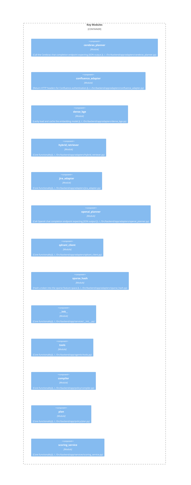

```mermaid
C4Component
    Container_Boundary(code, "Key Modules") {
        Component(cerebras_planner, "cerebras_planner", "Module", "[Call the Cerebras chat completion endpoint expecting JSON output.](../../Src/backend/app/adapters/cerebras_planner.py)")
        Component(confluence_adapter, "confluence_adapter", "Module", "[Return HTTP headers for Confluence authentication.](../../Src/backend/app/adapters/confluence_adapter.py)")
        Component(dense_bge, "dense_bge", "Module", "[Lazily load and cache the embedding model.](../../Src/backend/app/adapters/dense_bge.py)")
        Component(hybrid_retriever, "hybrid_retriever", "Module", "[Core functionality](../../Src/backend/app/adapters/hybrid_retriever.py)")
        Component(jira_adapter, "jira_adapter", "Module", "[Core functionality](../../Src/backend/app/adapters/jira_adapter.py)")
        Component(openai_planner, "openai_planner", "Module", "[Call OpenAI chat completion endpoint expecting JSON output.](../../Src/backend/app/adapters/openai_planner.py)")
        Component(qdrant_client, "qdrant_client", "Module", "[Core functionality](../../Src/backend/app/adapters/qdrant_client.py)")
        Component(sparse_hash, "sparse_hash", "Module", "[Hash a token into the sparse feature space.](../../Src/backend/app/adapters/sparse_hash.py)")
        Component(init, "__init__", "Module", "[Core functionality](../../Src/backend/app/agentic/__init__.py)")
        Component(tools, "tools", "Module", "[Core functionality](../../Src/backend/app/agentic/tools.py)")
        Component(compiler, "compiler", "Module", "[Core functionality](../../Src/backend/app/policy/compiler.py)")
        Component(plan, "plan", "Module", "[Core functionality](../../Src/backend/app/policy/plan.py)")
        Component(init, "__init__", "Module", "[Core functionality](../../Src/backend/app/services/__init__.py)")
        Component(scoring_service, "scoring_service", "Module", "[Core functionality](../../Src/backend/app/services/scoring_service.py)")
    }
```
