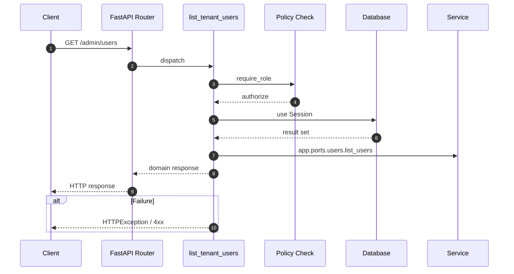

# API GET /admin/users

- Handler: `app.routes.admin_user_routes.list_tenant_users`
- Source: [app.routes.admin_user_routes](../Src/backend/app/routes/admin_user_routes.py#L18)
- Dependencies: `app.deps.get_db` via `db`, `app.deps.require_role` via `user` (roles: Admin)
- Response model: `UserListResp`

