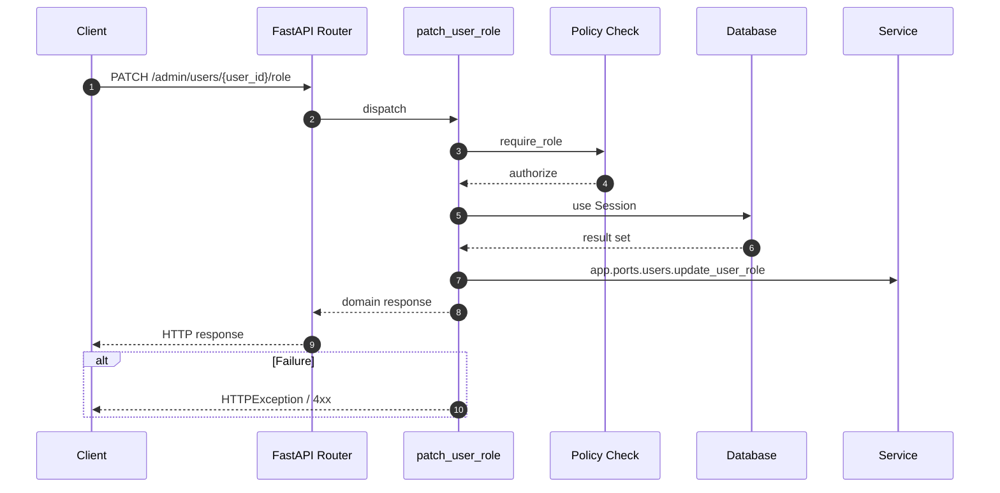

# API PATCH /admin/users/{user_id}/role

- Handler: `app.routes.admin_user_routes.patch_user_role`
- Source: [app.routes.admin_user_routes](../Src/backend/app/routes/admin_user_routes.py#L29)
- Dependencies: `app.deps.get_db` via `db`, `app.deps.require_role` via `user` (roles: Admin)
- Response model: `UserResp`

