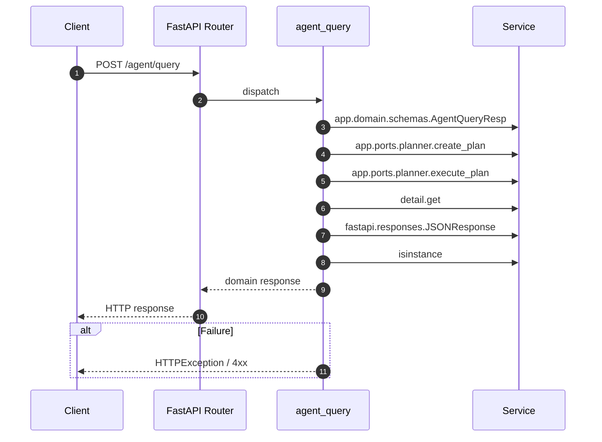

# API POST /agent/query

- Handler: `app.routes.agent_routes.agent_query`
- Source: [app.routes.agent_routes](../Src/backend/app/routes/agent_routes.py#L18)
- Dependencies: `app.deps.require_role` via `user`
- Response model: `AgentQueryResp`

