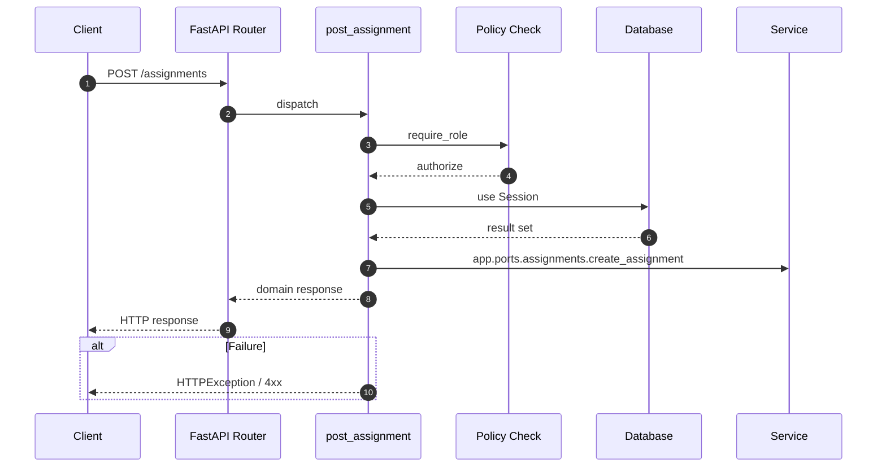

# API POST /assignments

- Handler: `app.routes.assignment_routes.post_assignment`
- Source: [app.routes.assignment_routes](../Src/backend/app/routes/assignment_routes.py#L27)
- Dependencies: `app.deps.get_db` via `db`, `app.deps.require_role` via `user` (roles: Admin, PO)
- Response model: `AssignmentResp`

