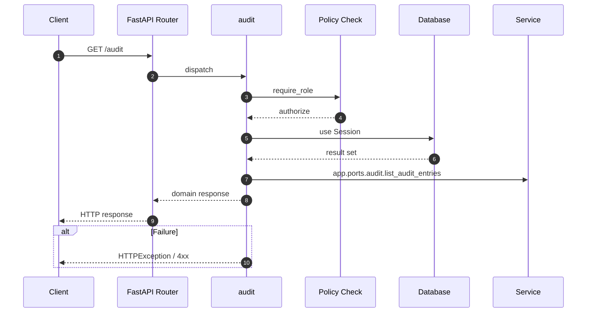

# API GET /audit

- Handler: `app.routes.audit_routes.audit`
- Source: [app.routes.audit_routes](../Src/backend/app/routes/audit_routes.py#L18)
- Dependencies: `app.deps.get_db` via `db`, `app.deps.require_role` via `_user` (roles: Admin, PO, BA)
- Response model: `AuditResp`

