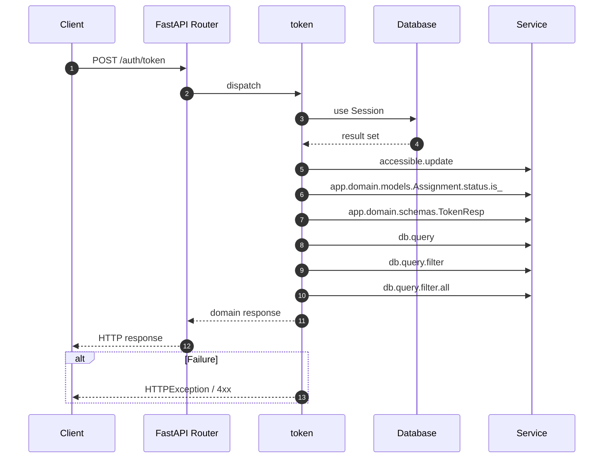

# API POST /auth/token

- Handler: `app.routes.auth_routes.token`
- Source: [app.routes.auth_routes](../Src/backend/app/routes/auth_routes.py#L22)
- Dependencies: `app.deps.get_db` via `db`
- Response model: `TokenResp`

