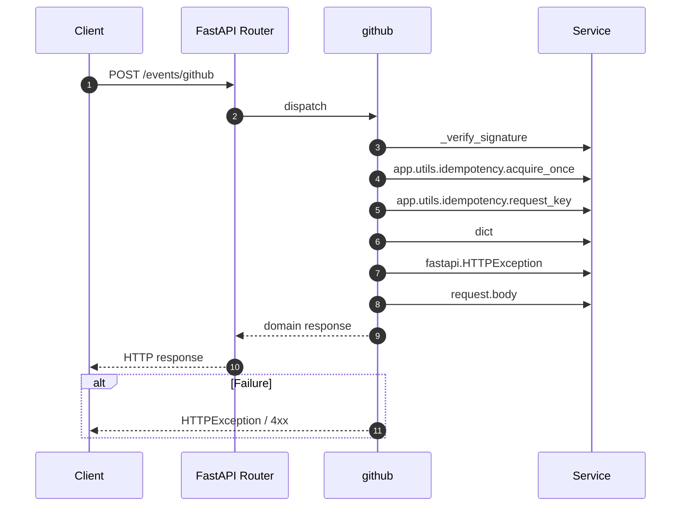

# API POST /events/github

- Handler: `app.routes.github_routes.github`
- Source: [app.routes.github_routes](../Src/backend/app/routes/github_routes.py#L30)

```mermaid
sequenceDiagram
    autonumber
    participant Client
    participant API as FastAPI Router
    participant Handler as github
    Client->>API: POST /events/github
    API->>Handler: dispatch
    Handler->>Service: _verify_signature
    Handler->>Service: app.utils.idempotency.acquire_once
    Handler->>Service: app.utils.idempotency.request_key
    Handler->>Service: dict
    Handler->>Service: fastapi.HTTPException
    Handler->>Service: request.body
    Handler-->>API: domain response
    API-->>Client: HTTP response
    alt Failure
        Handler-->>Client: HTTPException / 4xx
    end
```