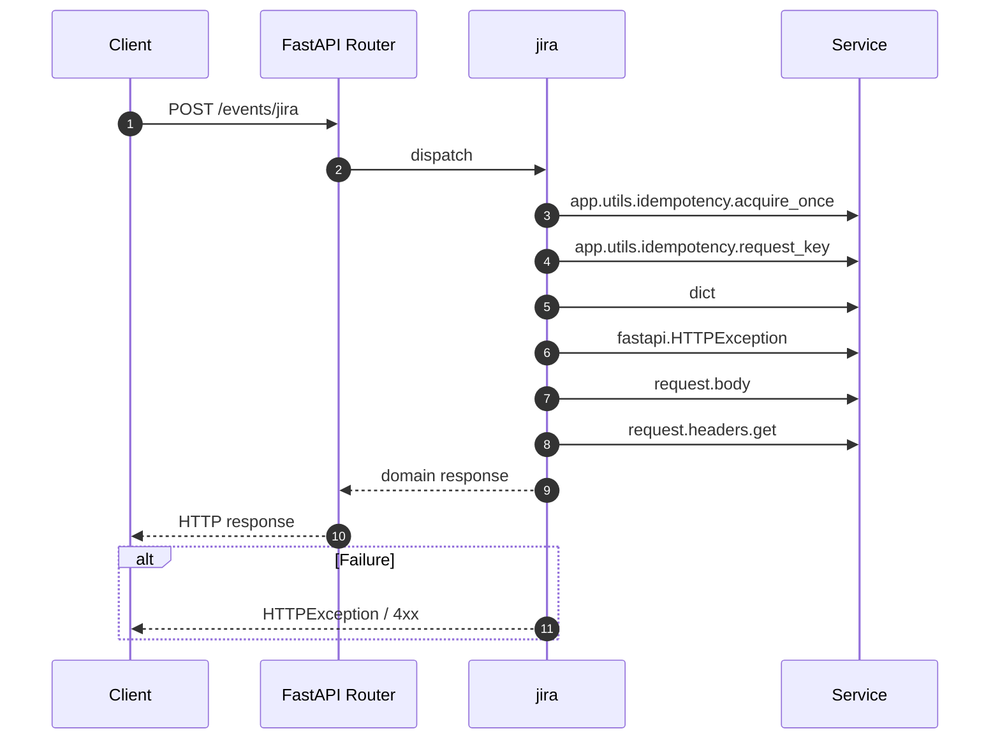

# API POST /events/jira

- Handler: `app.routes.jira_routes.jira`
- Source: [app.routes.jira_routes](../Src/backend/app/routes/jira_routes.py#L17)

```mermaid
sequenceDiagram
    autonumber
    participant Client
    participant API as FastAPI Router
    participant Handler as jira
    Client->>API: POST /events/jira
    API->>Handler: dispatch
    Handler->>Service: app.utils.idempotency.acquire_once
    Handler->>Service: app.utils.idempotency.request_key
    Handler->>Service: dict
    Handler->>Service: fastapi.HTTPException
    Handler->>Service: request.body
    Handler->>Service: request.headers.get
    Handler-->>API: domain response
    API-->>Client: HTTP response
    alt Failure
        Handler-->>Client: HTTPException / 4xx
    end
```