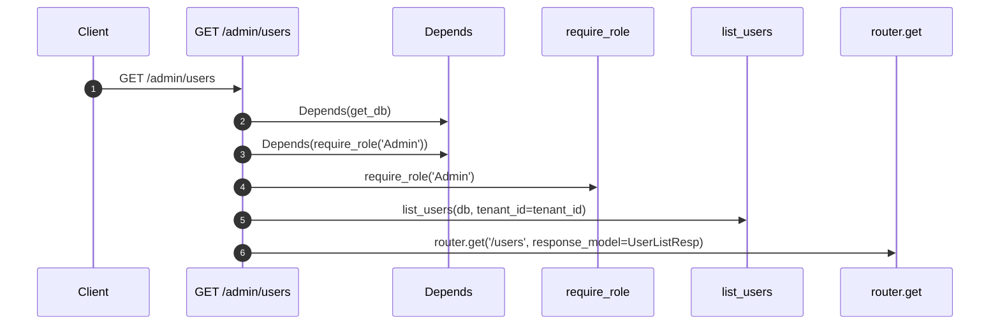

# Sequence: GET /admin/users

**Source:** [`admin_user_routes.py`](../../Src/backend/app/routes/admin_user_routes.py#L18)

```mermaid
sequenceDiagram
    autonumber
    participant Client as Client
    participant API as GET /admin/users
    participant Depends as Depends
    participant Require_role as require_role
    participant List_users as list_users
    participant Router as router.get
    Client->>API: GET /admin/users
    API->>Depends: Depends(get_db)
    API->>Depends: Depends(require_role('Admin'))
    API->>Require_role: require_role('Admin')
    API->>List_users: list_users(db, tenant_id=tenant_id)
    API->>Router: router.get('/users', response_model=UserListResp)
```
