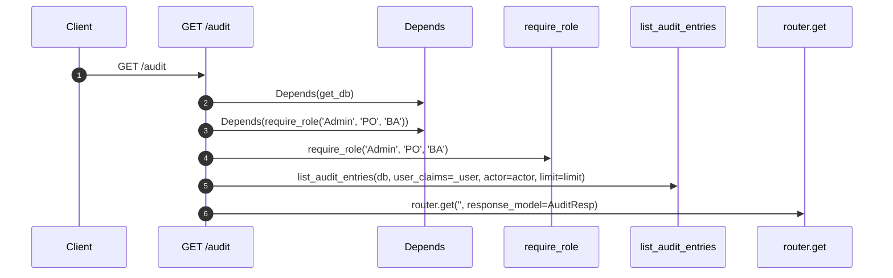

# Sequence: GET /audit

**Source:** [`audit_routes.py`](../../Src/backend/app/routes/audit_routes.py#L18)

```mermaid
sequenceDiagram
    autonumber
    participant Client as Client
    participant API as GET /audit
    participant Depends as Depends
    participant Require_role as require_role
    participant List_audit_entries as list_audit_entries
    participant Router as router.get
    Client->>API: GET /audit
    API->>Depends: Depends(get_db)
    API->>Depends: Depends(require_role('Admin', 'PO', 'BA'))
    API->>Require_role: require_role('Admin', 'PO', 'BA')
    API->>List_audit_entries: list_audit_entries(db, user_claims=_user, actor=actor, limit=limit)
    API->>Router: router.get('', response_model=AuditResp)
```
