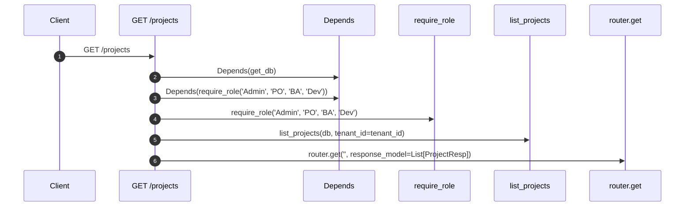

# Sequence: GET /projects

**Source:** [`project_read_routes.py`](../../Src/backend/app/routes/project_read_routes.py#L18)

```mermaid
sequenceDiagram
    autonumber
    participant Client as Client
    participant API as GET /projects
    participant Depends as Depends
    participant Require_role as require_role
    participant List_projects as list_projects
    participant Router as router.get
    Client->>API: GET /projects
    API->>Depends: Depends(get_db)
    API->>Depends: Depends(require_role('Admin', 'PO', 'BA', 'Dev'))
    API->>Require_role: require_role('Admin', 'PO', 'BA', 'Dev')
    API->>List_projects: list_projects(db, tenant_id=tenant_id)
    API->>Router: router.get('', response_model=List[ProjectResp])
```
