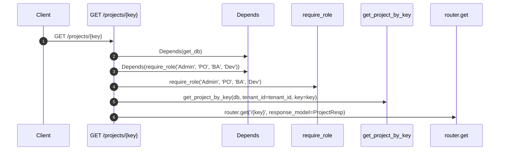

# Sequence: GET /projects/{key}

**Source:** [`project_read_routes.py`](../../Src/backend/app/routes/project_read_routes.py#L29)

```mermaid
sequenceDiagram
    autonumber
    participant Client as Client
    participant API as GET /projects/{key}
    participant Depends as Depends
    participant Require_role as require_role
    participant Get_project_by_key as get_project_by_key
    participant Router as router.get
    Client->>API: GET /projects/{key}
    API->>Depends: Depends(get_db)
    API->>Depends: Depends(require_role('Admin', 'PO', 'BA', 'Dev'))
    API->>Require_role: require_role('Admin', 'PO', 'BA', 'Dev')
    API->>Get_project_by_key: get_project_by_key(db, tenant_id=tenant_id, key=key)
    API->>Router: router.get('/{key}', response_model=ProjectResp)
```
