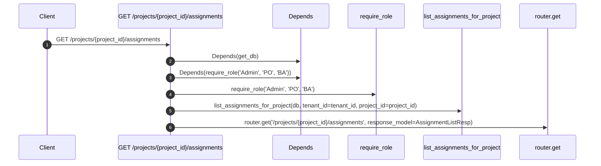

# Sequence: GET /projects/{project_id}/assignments

**Source:** [`assignment_routes.py`](../../Src/backend/app/routes/assignment_routes.py#L66)

```mermaid
sequenceDiagram
    autonumber
    participant Client as Client
    participant API as GET /projects/{project_id}/assignments
    participant Depends as Depends
    participant Require_role as require_role
    participant List_assignments_for_project as list_assignments_for_project
    participant Router as router.get
    Client->>API: GET /projects/{project_id}/assignments
    API->>Depends: Depends(get_db)
    API->>Depends: Depends(require_role('Admin', 'PO', 'BA'))
    API->>Require_role: require_role('Admin', 'PO', 'BA')
    API->>List_assignments_for_project: list_assignments_for_project(db, tenant_id=tenant_id, project_id=project_id)
    API->>Router: router.get('/projects/{project_id}/assignments', response_model=AssignmentListResp)
```
