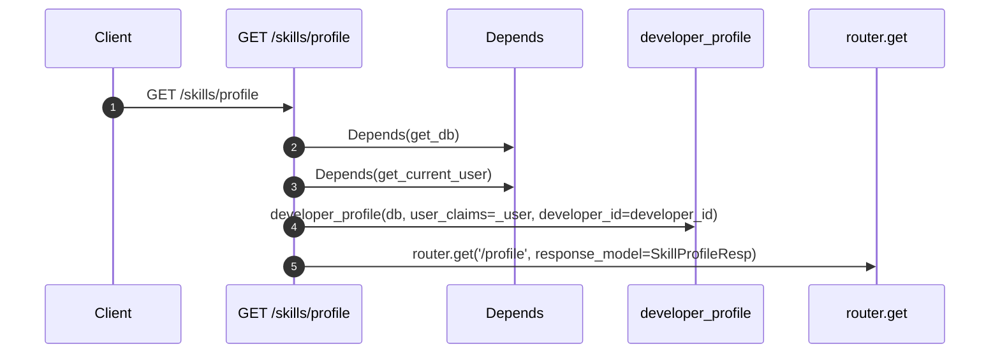

# Sequence: GET /skills/profile

**Source:** [`skills_routes.py`](../../Src/backend/app/routes/skills_routes.py#L18)

```mermaid
sequenceDiagram
    autonumber
    participant Client as Client
    participant API as GET /skills/profile
    participant Depends as Depends
    participant Developer_profile as developer_profile
    participant Router as router.get
    Client->>API: GET /skills/profile
    API->>Depends: Depends(get_db)
    API->>Depends: Depends(get_current_user)
    API->>Developer_profile: developer_profile(db, user_claims=_user, developer_id=developer_id)
    API->>Router: router.get('/profile', response_model=SkillProfileResp)
```
