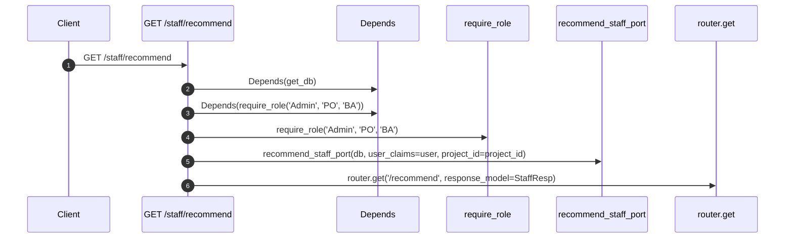

# Sequence: GET /staff/recommend

**Source:** [`staff_routes.py`](../../Src/backend/app/routes/staff_routes.py#L18)

```mermaid
sequenceDiagram
    autonumber
    participant Client as Client
    participant API as GET /staff/recommend
    participant Depends as Depends
    participant Require_role as require_role
    participant Recommend_staff_port as recommend_staff_port
    participant Router as router.get
    Client->>API: GET /staff/recommend
    API->>Depends: Depends(get_db)
    API->>Depends: Depends(require_role('Admin', 'PO', 'BA'))
    API->>Require_role: require_role('Admin', 'PO', 'BA')
    API->>Recommend_staff_port: recommend_staff_port(db, user_claims=user, project_id=project_id)
    API->>Router: router.get('/recommend', response_model=StaffResp)
```
