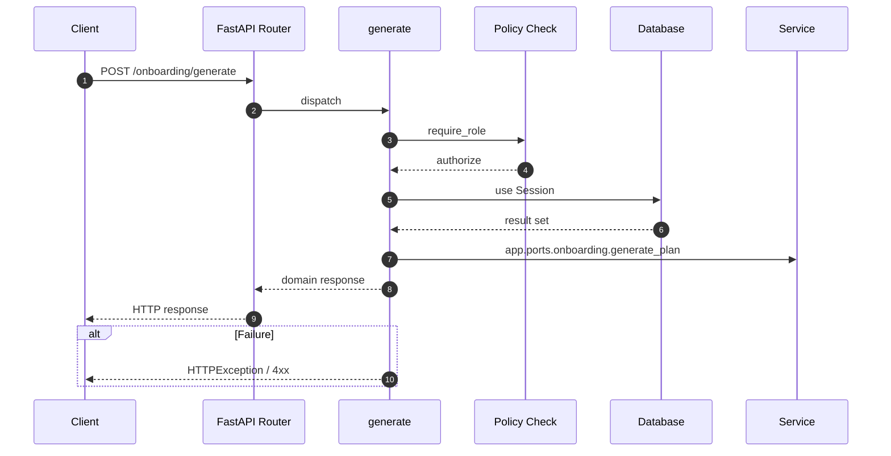

# API POST /onboarding/generate

- Handler: `app.routes.onboarding_routes.generate`
- Source: [app.routes.onboarding_routes](../Src/backend/app/routes/onboarding_routes.py#L18)
- Dependencies: `app.deps.get_db` via `db`, `app.deps.require_role` via `user` (roles: Admin, PO)
- Response model: `OnboardingResp`

