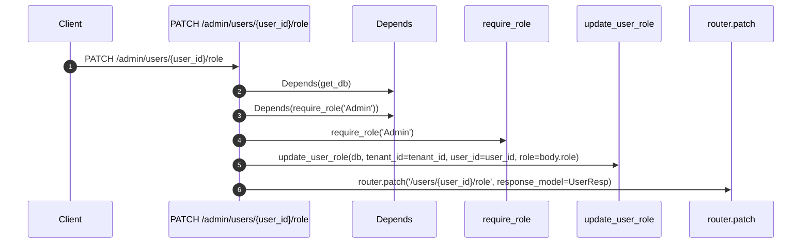

# Sequence: PATCH /admin/users/{user_id}/role

**Source:** [`admin_user_routes.py`](../../Src/backend/app/routes/admin_user_routes.py#L29)

```mermaid
sequenceDiagram
    autonumber
    participant Client as Client
    participant API as PATCH /admin/users/{user_id}/role
    participant Depends as Depends
    participant Require_role as require_role
    participant Update_user_role as update_user_role
    participant Router as router.patch
    Client->>API: PATCH /admin/users/{user_id}/role
    API->>Depends: Depends(get_db)
    API->>Depends: Depends(require_role('Admin'))
    API->>Require_role: require_role('Admin')
    API->>Update_user_role: update_user_role(db, tenant_id=tenant_id, user_id=user_id, role=body.role)
    API->>Router: router.patch('/users/{user_id}/role', response_model=UserResp)
```
