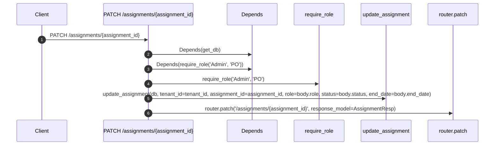

# Sequence: PATCH /assignments/{assignment_id}

**Source:** [`assignment_routes.py`](../../Src/backend/app/routes/assignment_routes.py#L46)

```mermaid
sequenceDiagram
    autonumber
    participant Client as Client
    participant API as PATCH /assignments/{assignment_id}
    participant Depends as Depends
    participant Require_role as require_role
    participant Update_assignment as update_assignment
    participant Router as router.patch
    Client->>API: PATCH /assignments/{assignment_id}
    API->>Depends: Depends(get_db)
    API->>Depends: Depends(require_role('Admin', 'PO'))
    API->>Require_role: require_role('Admin', 'PO')
    API->>Update_assignment: update_assignment(db, tenant_id=tenant_id, assignment_id=assignment_id, role=body.role, status=body.status, end_date=body.end_date)
    API->>Router: router.patch('/assignments/{assignment_id}', response_model=AssignmentResp)
```
