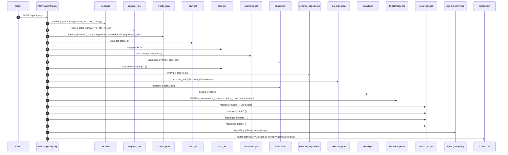

# Sequence: POST /agent/query

**Source:** [`agent_routes.py`](../../Src/backend/app/routes/agent_routes.py#L18)

```mermaid
sequenceDiagram
    autonumber
    participant Client as Client
    participant API as POST /agent/query
    participant Depends as Depends
    participant Require_role as require_role
    participant Create_plan as create_plan
    participant Plan as plan.get
    participant Step as step.get
    participant Overrides as overrides.get
    participant Isinstance as isinstance
    participant Override_args as override_args.items
    participant Execute_plan as execute_plan
    participant Detail as detail.get
    participant Jsonresponse as JSONResponse
    participant Result as result.get.get
    participant Agentqueryresp as AgentQueryResp
    participant Router as router.post
    Client->>API: POST /agent/query
    API->>Depends: Depends(require_role(('Admin', 'PO', 'BA', 'Dev')))
    API->>Require_role: require_role(('Admin', 'PO', 'BA', 'Dev'))
    API->>Create_plan: create_plan(task_prompt=req.prompt, allowed_tools=req.allowed_tools)
    API->>Plan: plan.get('steps', [])
    API->>Step: step.get('tool')
    API->>Overrides: overrides.get(tool_name)
    API->>Isinstance: isinstance(override_args, dict)
    API->>Step: step.setdefault('args', {})
    API->>Override_args: override_args.items()
    API->>Execute_plan: execute_plan(plan, user_claims=user)
    API->>Isinstance: isinstance(detail, dict)
    API->>Detail: detail.get('code')
    API->>Jsonresponse: JSONResponse(status_code=exc.status_code, content=detail)
    API->>Result: result.get('output', {}).get('notes')
    API->>Result: result.get('output', {})
    API->>Result: result.get('artifacts', {})
    API->>Result: result.get('output', {})
    API->>Agentqueryresp: AgentQueryResp(**resp_kwargs)
    API->>Router: router.post('/query', response_model=AgentQueryResp)
```
