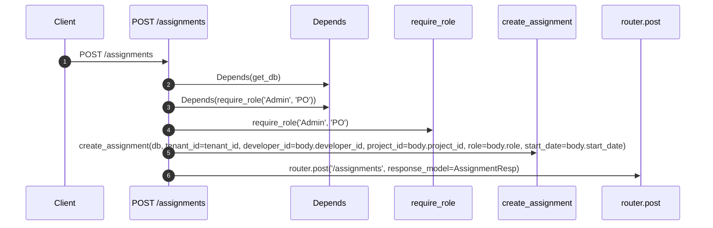

# Sequence: POST /assignments

**Source:** [`assignment_routes.py`](../../Src/backend/app/routes/assignment_routes.py#L27)

```mermaid
sequenceDiagram
    autonumber
    participant Client as Client
    participant API as POST /assignments
    participant Depends as Depends
    participant Require_role as require_role
    participant Create_assignment as create_assignment
    participant Router as router.post
    Client->>API: POST /assignments
    API->>Depends: Depends(get_db)
    API->>Depends: Depends(require_role('Admin', 'PO'))
    API->>Require_role: require_role('Admin', 'PO')
    API->>Create_assignment: create_assignment(db, tenant_id=tenant_id, developer_id=body.developer_id, project_id=body.project_id, role=body.role, start_date=body.start_date)
    API->>Router: router.post('/assignments', response_model=AssignmentResp)
```
