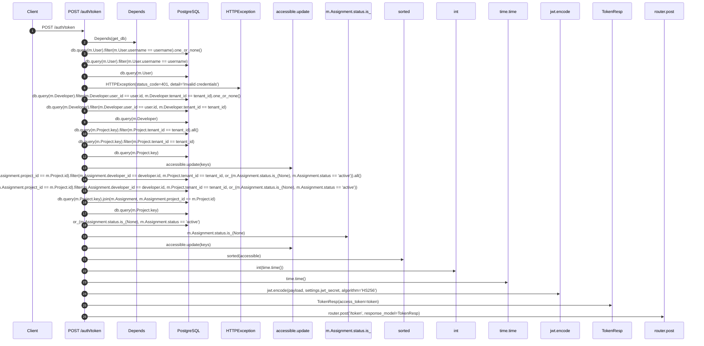

# Sequence: POST /auth/token

**Source:** [`auth_routes.py`](../../Src/backend/app/routes/auth_routes.py#L22)

```mermaid
sequenceDiagram
    autonumber
    participant Client as Client
    participant API as POST /auth/token
    participant Depends as Depends
    participant DB as PostgreSQL
    participant Httpexception as HTTPException
    participant Accessible as accessible.update
    participant M as m.Assignment.status.is_
    participant Sorted as sorted
    participant Int as int
    participant Time as time.time
    participant Jwt as jwt.encode
    participant Tokenresp as TokenResp
    participant Router as router.post
    Client->>API: POST /auth/token
    API->>Depends: Depends(get_db)
    API->>DB: db.query(m.User).filter(m.User.username == username).one_or_none()
    API->>DB: db.query(m.User).filter(m.User.username == username)
    API->>DB: db.query(m.User)
    API->>Httpexception: HTTPException(status_code=401, detail='Invalid credentials')
    API->>DB: db.query(m.Developer).filter(m.Developer.user_id == user.id, m.Developer.tenant_id == tenant_id).one_or_none()
    API->>DB: db.query(m.Developer).filter(m.Developer.user_id == user.id, m.Developer.tenant_id == tenant_id)
    API->>DB: db.query(m.Developer)
    API->>DB: db.query(m.Project.key).filter(m.Project.tenant_id == tenant_id).all()
    API->>DB: db.query(m.Project.key).filter(m.Project.tenant_id == tenant_id)
    API->>DB: db.query(m.Project.key)
    API->>Accessible: accessible.update(keys)
    API->>DB: db.query(m.Project.key).join(m.Assignment, m.Assignment.project_id == m.Project.id).filter(m.Assignment.developer_id == developer.id, m.Project.tenant_id == tenant_id, or_(m.Assignment.status.is_(None), m.Assignment.status == 'active')).all()
    API->>DB: db.query(m.Project.key).join(m.Assignment, m.Assignment.project_id == m.Project.id).filter(m.Assignment.developer_id == developer.id, m.Project.tenant_id == tenant_id, or_(m.Assignment.status.is_(None), m.Assignment.status == 'active'))
    API->>DB: db.query(m.Project.key).join(m.Assignment, m.Assignment.project_id == m.Project.id)
    API->>DB: db.query(m.Project.key)
    API->>DB: or_(m.Assignment.status.is_(None), m.Assignment.status == 'active')
    API->>M: m.Assignment.status.is_(None)
    API->>Accessible: accessible.update(keys)
    API->>Sorted: sorted(accessible)
    API->>Int: int(time.time())
    API->>Time: time.time()
    API->>Jwt: jwt.encode(payload, settings.jwt_secret, algorithm='HS256')
    API->>Tokenresp: TokenResp(access_token=token)
    API->>Router: router.post('/token', response_model=TokenResp)
```
