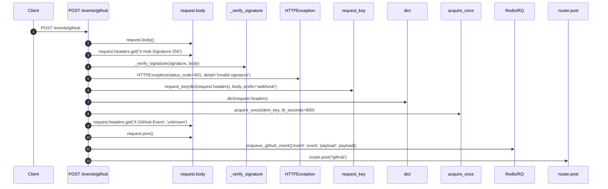

# Sequence: POST /events/github

**Source:** [`github_routes.py`](../../Src/backend/app/routes/github_routes.py#L30)

```mermaid
sequenceDiagram
    autonumber
    participant Client as Client
    participant API as POST /events/github
    participant Request as request.body
    participant Verify_signature as _verify_signature
    participant Httpexception as HTTPException
    participant Request_key as request_key
    participant Dict as dict
    participant Acquire_once as acquire_once
    participant Queue as Redis/RQ
    participant Router as router.post
    Client->>API: POST /events/github
    API->>Request: request.body()
    API->>Request: request.headers.get('X-Hub-Signature-256')
    API->>Verify_signature: _verify_signature(signature, body)
    API->>Httpexception: HTTPException(status_code=401, detail='Invalid signature')
    API->>Request_key: request_key(dict(request.headers), body, prefix='webhook')
    API->>Dict: dict(request.headers)
    API->>Acquire_once: acquire_once(idem_key, ttl_seconds=900)
    API->>Request: request.headers.get('X-GitHub-Event', 'unknown')
    API->>Request: request.json()
    API->>Queue: enqueue_github_event({'event': event, 'payload': payload})
    API->>Router: router.post('/github')
```
