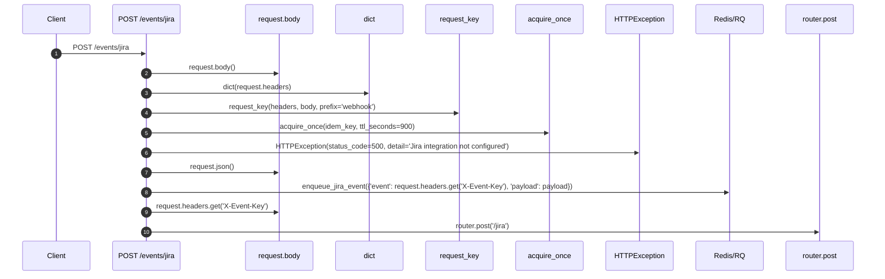

# Sequence: POST /events/jira

**Source:** [`jira_routes.py`](../../Src/backend/app/routes/jira_routes.py#L17)

```mermaid
sequenceDiagram
    autonumber
    participant Client as Client
    participant API as POST /events/jira
    participant Request as request.body
    participant Dict as dict
    participant Request_key as request_key
    participant Acquire_once as acquire_once
    participant Httpexception as HTTPException
    participant Queue as Redis/RQ
    participant Router as router.post
    Client->>API: POST /events/jira
    API->>Request: request.body()
    API->>Dict: dict(request.headers)
    API->>Request_key: request_key(headers, body, prefix='webhook')
    API->>Acquire_once: acquire_once(idem_key, ttl_seconds=900)
    API->>Httpexception: HTTPException(status_code=500, detail='Jira integration not configured')
    API->>Request: request.json()
    API->>Queue: enqueue_jira_event({'event': request.headers.get('X-Event-Key'), 'payload': payload})
    API->>Request: request.headers.get('X-Event-Key')
    API->>Router: router.post('/jira')
```
