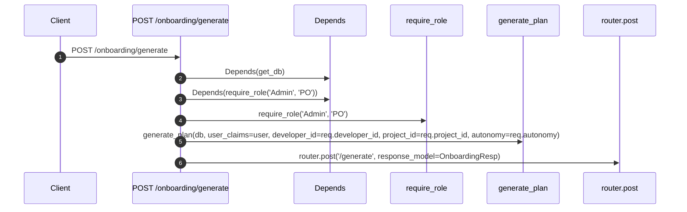

# Sequence: POST /onboarding/generate

**Source:** [`onboarding_routes.py`](../../Src/backend/app/routes/onboarding_routes.py#L18)

```mermaid
sequenceDiagram
    autonumber
    participant Client as Client
    participant API as POST /onboarding/generate
    participant Depends as Depends
    participant Require_role as require_role
    participant Generate_plan as generate_plan
    participant Router as router.post
    Client->>API: POST /onboarding/generate
    API->>Depends: Depends(get_db)
    API->>Depends: Depends(require_role('Admin', 'PO'))
    API->>Require_role: require_role('Admin', 'PO')
    API->>Generate_plan: generate_plan(db, user_claims=user, developer_id=req.developer_id, project_id=req.project_id, autonomy=req.autonomy)
    API->>Router: router.post('/generate', response_model=OnboardingResp)
```
