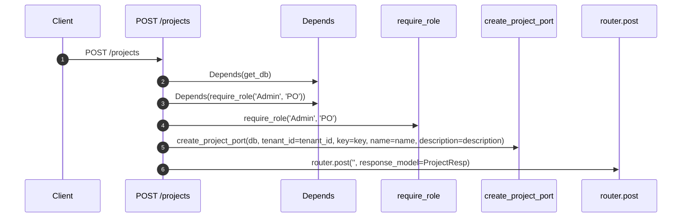

# Sequence: POST /projects

**Source:** [`project_routes.py`](../../Src/backend/app/routes/project_routes.py#L18)

```mermaid
sequenceDiagram
    autonumber
    participant Client as Client
    participant API as POST /projects
    participant Depends as Depends
    participant Require_role as require_role
    participant Create_project_port as create_project_port
    participant Router as router.post
    Client->>API: POST /projects
    API->>Depends: Depends(get_db)
    API->>Depends: Depends(require_role('Admin', 'PO'))
    API->>Require_role: require_role('Admin', 'PO')
    API->>Create_project_port: create_project_port(db, tenant_id=tenant_id, key=key, name=name, description=description)
    API->>Router: router.post('', response_model=ProjectResp)
```
