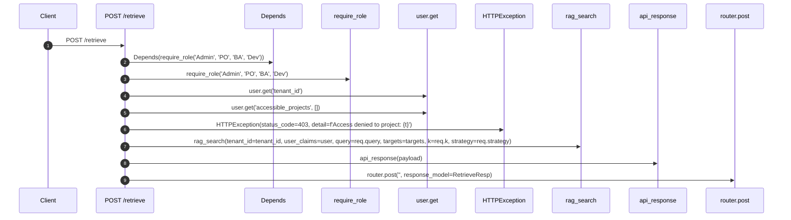

# Sequence: POST /retrieve

**Source:** [`retrieve_routes.py`](../../Src/backend/app/routes/retrieve_routes.py#L10)

```mermaid
sequenceDiagram
    autonumber
    participant Client as Client
    participant API as POST /retrieve
    participant Depends as Depends
    participant Require_role as require_role
    participant User as user.get
    participant Httpexception as HTTPException
    participant Rag_search as rag_search
    participant Api_response as api_response
    participant Router as router.post
    Client->>API: POST /retrieve
    API->>Depends: Depends(require_role('Admin', 'PO', 'BA', 'Dev'))
    API->>Require_role: require_role('Admin', 'PO', 'BA', 'Dev')
    API->>User: user.get('tenant_id')
    API->>User: user.get('accessible_projects', [])
    API->>Httpexception: HTTPException(status_code=403, detail=f'Access denied to project: {t}')
    API->>Rag_search: rag_search(tenant_id=tenant_id, user_claims=user, query=req.query, targets=targets, k=req.k, strategy=req.strategy)
    API->>Api_response: api_response(payload)
    API->>Router: router.post('', response_model=RetrieveResp)
```
