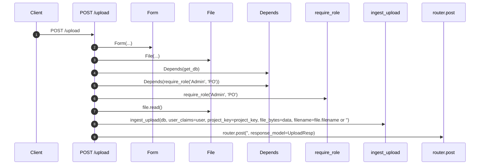

# Sequence: POST /upload

**Source:** [`upload_routes.py`](../../Src/backend/app/routes/upload_routes.py#L18)

```mermaid
sequenceDiagram
    autonumber
    participant Client as Client
    participant API as POST /upload
    participant Form as Form
    participant File as File
    participant Depends as Depends
    participant Require_role as require_role
    participant Ingest_upload as ingest_upload
    participant Router as router.post
    Client->>API: POST /upload
    API->>Form: Form(...)
    API->>File: File(...)
    API->>Depends: Depends(get_db)
    API->>Depends: Depends(require_role('Admin', 'PO'))
    API->>Require_role: require_role('Admin', 'PO')
    API->>File: file.read()
    API->>Ingest_upload: ingest_upload(db, user_claims=user, project_key=project_key, file_bytes=data, filename=file.filename or '')
    API->>Router: router.post('', response_model=UploadResp)
```
