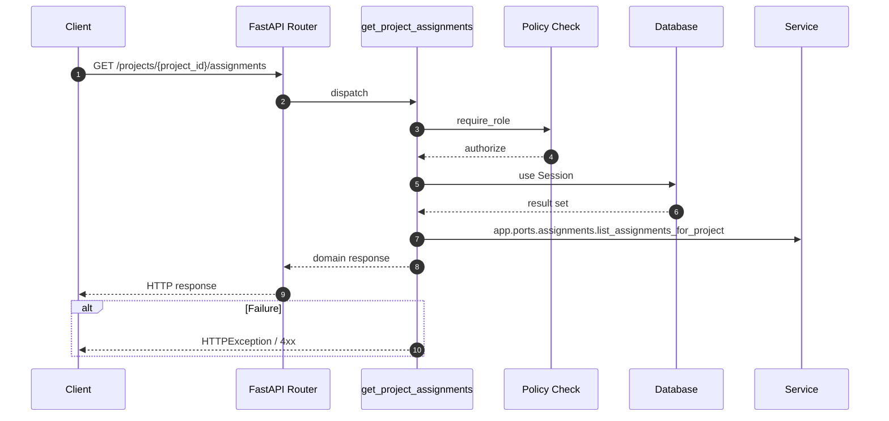

# API GET /projects/{project_id}/assignments

- Handler: `app.routes.assignment_routes.get_project_assignments`
- Source: [app.routes.assignment_routes](../Src/backend/app/routes/assignment_routes.py#L66)
- Dependencies: `app.deps.get_db` via `db`, `app.deps.require_role` via `user` (roles: Admin, PO, BA)
- Response model: `AssignmentListResp`

