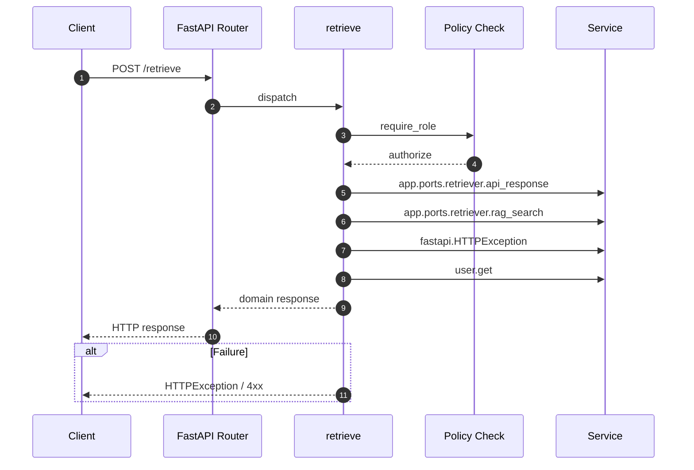

# API POST /retrieve

- Handler: `app.routes.retrieve_routes.retrieve`
- Source: [app.routes.retrieve_routes](../Src/backend/app/routes/retrieve_routes.py#L10)
- Dependencies: `app.deps.require_role` via `user` (roles: Admin, PO, BA, Dev)
- Response model: `RetrieveResp`

