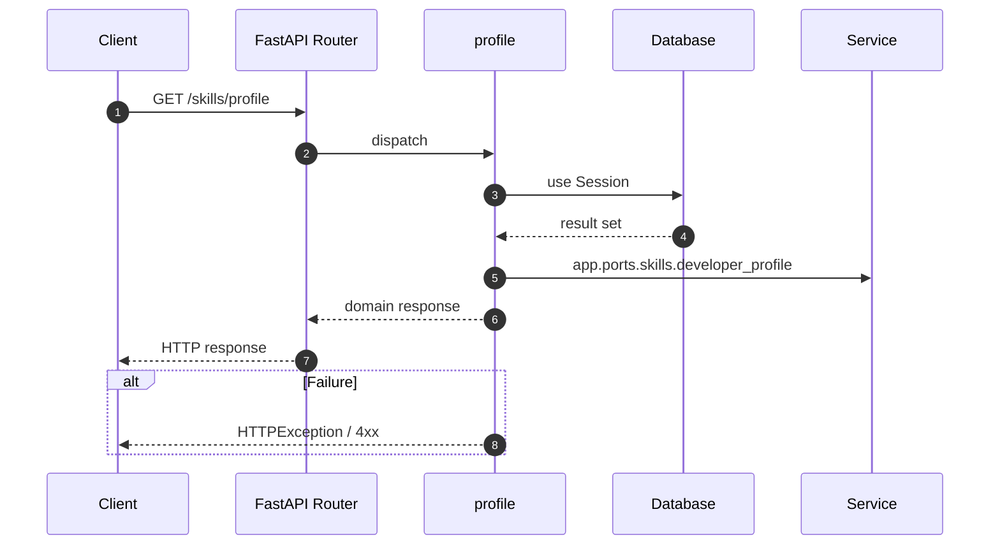

# API GET /skills/profile

- Handler: `app.routes.skills_routes.profile`
- Source: [app.routes.skills_routes](../Src/backend/app/routes/skills_routes.py#L18)
- Dependencies: `app.deps.get_db` via `db`, `app.deps.get_current_user` via `_user`
- Response model: `SkillProfileResp`

