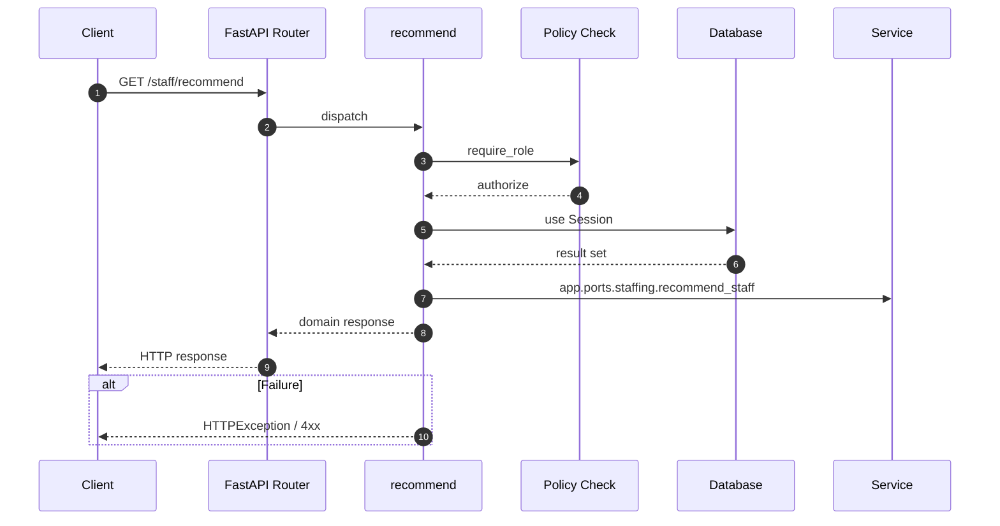

# API GET /staff/recommend

- Handler: `app.routes.staff_routes.recommend`
- Source: [app.routes.staff_routes](../Src/backend/app/routes/staff_routes.py#L18)
- Dependencies: `app.deps.get_db` via `db`, `app.deps.require_role` via `user` (roles: Admin, PO, BA)
- Response model: `StaffResp`

