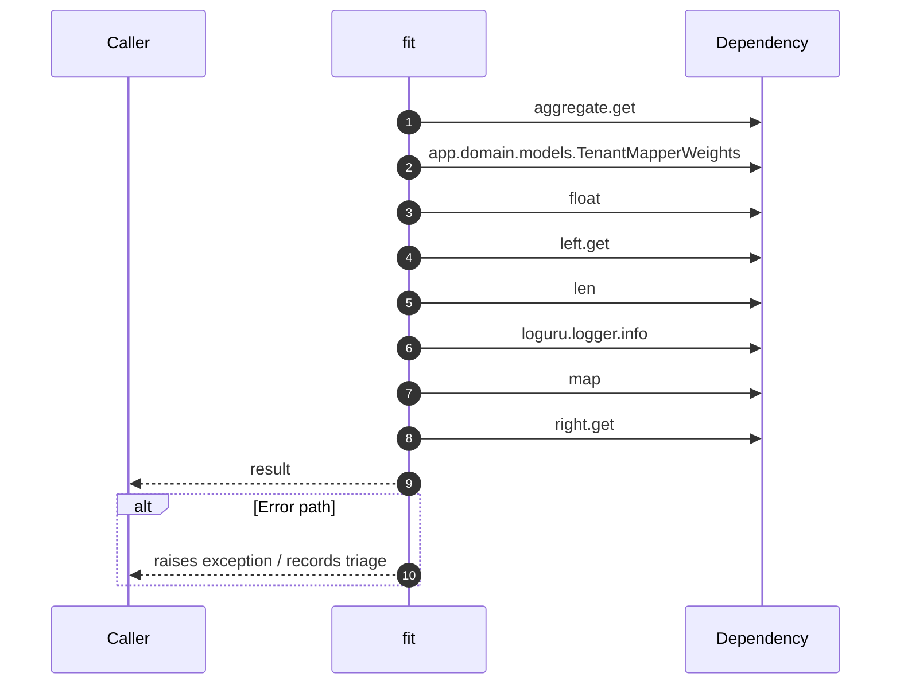

# Internal flow — `app.application.contrastive_mapper.ABMapper.fit`

- Module: `app.application.contrastive_mapper`
- Source: [app.application.contrastive_mapper.ABMapper.fit](../Src/backend/app/application/contrastive_mapper.py#L84)

