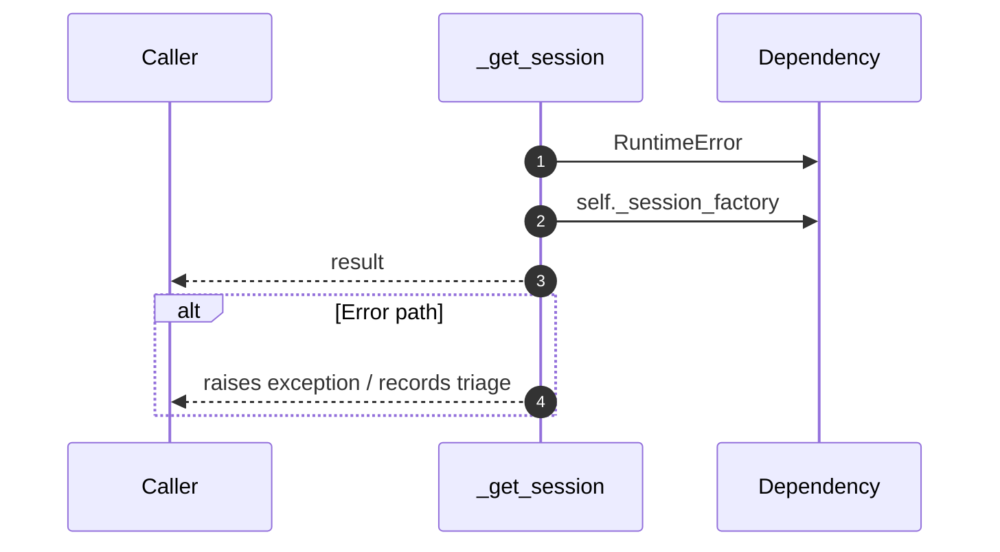

# Internal flow — `app.application.contrastive_mapper.ABMapper._get_session`

- Module: `app.application.contrastive_mapper`
- Source: [app.application.contrastive_mapper.ABMapper._get_session](../Src/backend/app/application/contrastive_mapper.py#L72)

