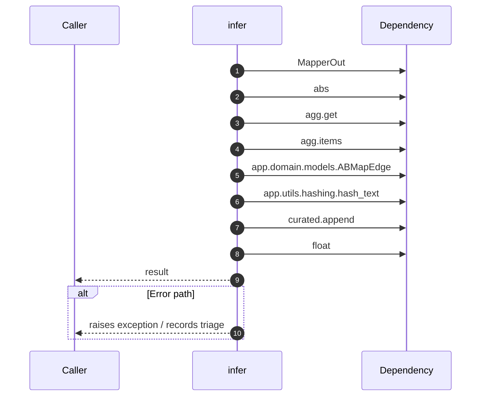

# Internal flow — `app.application.contrastive_mapper.ABMapper.infer`

- Module: `app.application.contrastive_mapper`
- Source: [app.application.contrastive_mapper.ABMapper.infer](../Src/backend/app/application/contrastive_mapper.py#L128)

