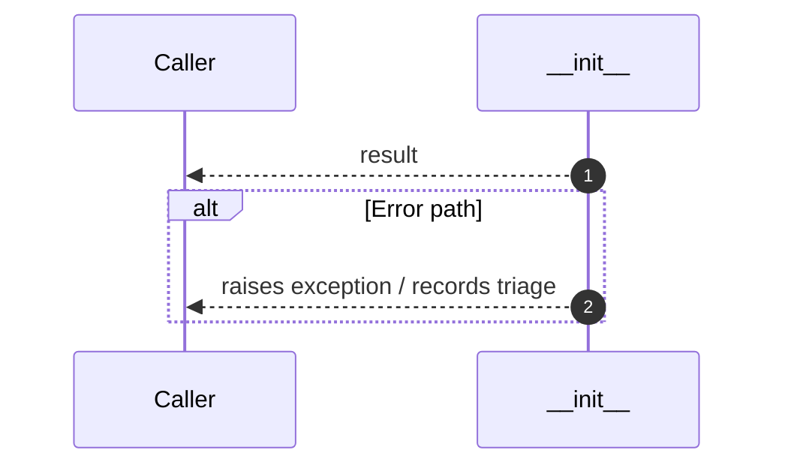

# Internal flow — `app.application.contrastive_mapper.ABMapper.__init__`

- Module: `app.application.contrastive_mapper`
- Source: [app.application.contrastive_mapper.ABMapper.__init__](../Src/backend/app/application/contrastive_mapper.py#L61)

