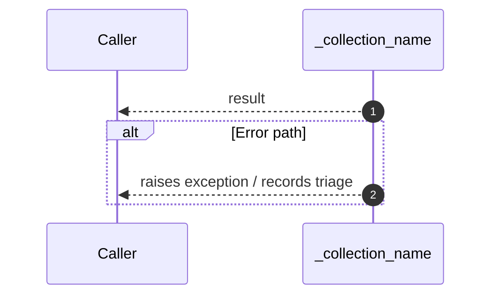

# Internal flow — `app.application.ingestion_service._collection_name`

- Module: `app.application.ingestion_service`
- Source: [app.application.ingestion_service._collection_name](../Src/backend/app/application/ingestion_service.py#L23)
- Summary: Return the Qdrant collection name for the project.

