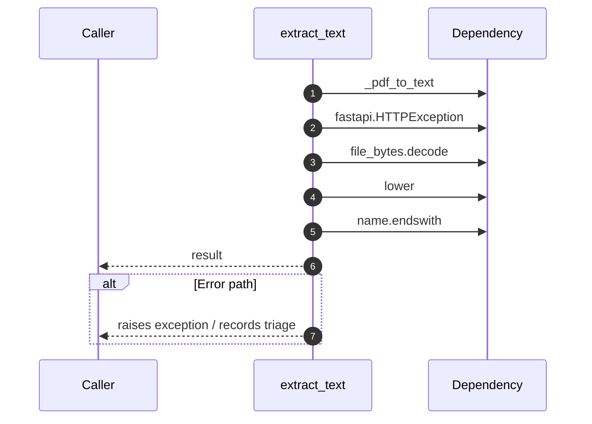

# Internal flow — `app.application.ingestion_service.extract_text`

- Module: `app.application.ingestion_service`
- Source: [app.application.ingestion_service.extract_text](../Src/backend/app/application/ingestion_service.py#L125)
- Summary: Decode file bytes into plain text using best-effort heuristics.

