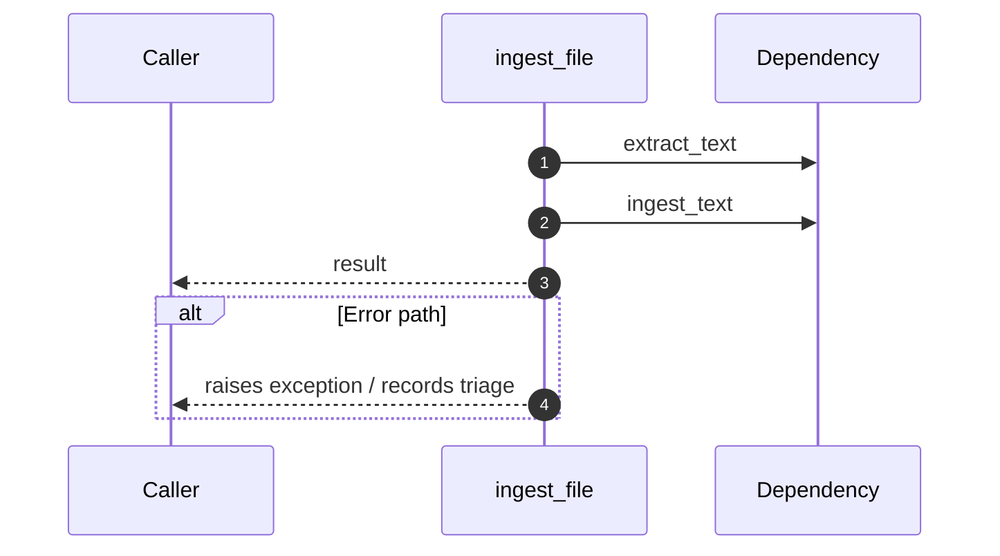

# Internal flow — `app.application.ingestion_service.ingest_file`

- Module: `app.application.ingestion_service`
- Source: [app.application.ingestion_service.ingest_file](../Src/backend/app/application/ingestion_service.py#L147)
- Summary: Ingest a file by dispatching to the correct decoder.

