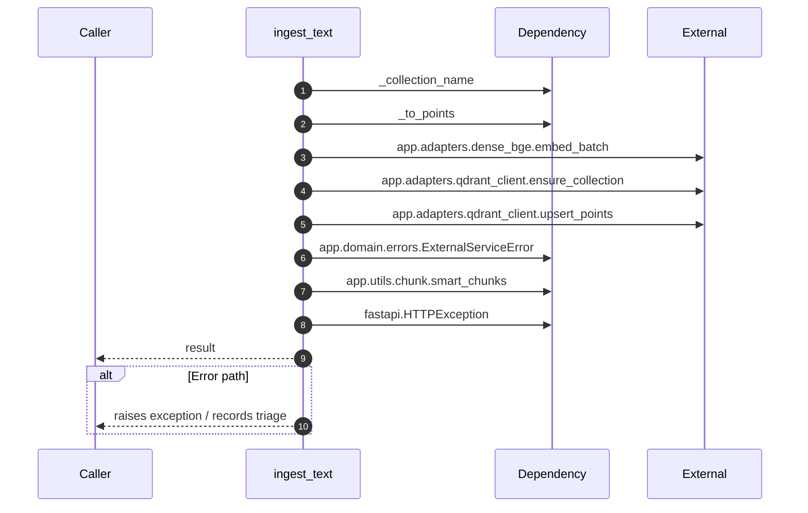

# Internal flow — `app.application.ingestion_service.ingest_text`

- Module: `app.application.ingestion_service`
- Source: [app.application.ingestion_service.ingest_text](../Src/backend/app/application/ingestion_service.py#L59)
- Summary: Chunk, embed, and upsert plain text into Qdrant.

