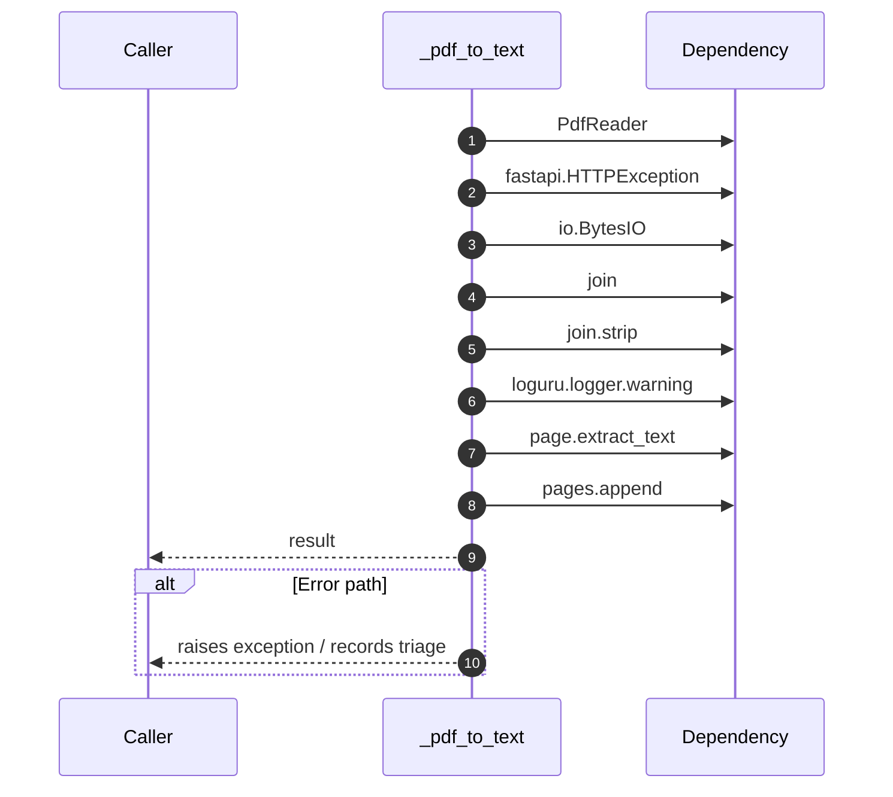

# Internal flow — `app.application.ingestion_service._pdf_to_text`

- Module: `app.application.ingestion_service`
- Source: [app.application.ingestion_service._pdf_to_text](../Src/backend/app/application/ingestion_service.py#L107)
- Summary: Extract text from a PDF file.

