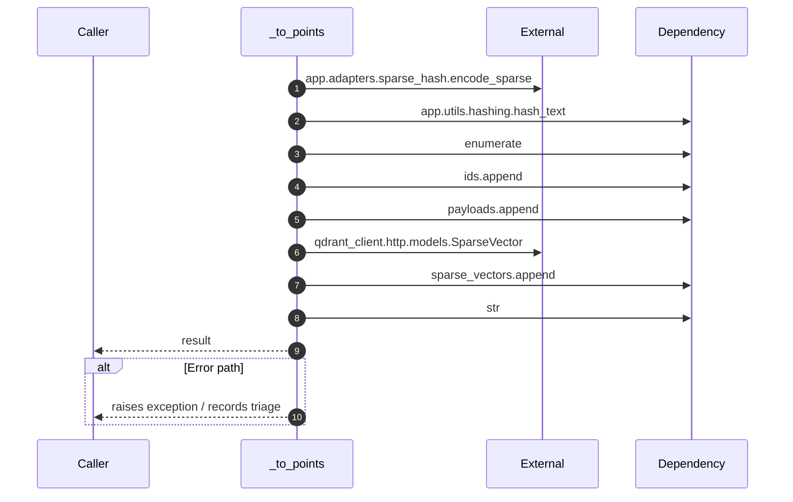

# Internal flow — `app.application.ingestion_service._to_points`

- Module: `app.application.ingestion_service`
- Source: [app.application.ingestion_service._to_points](../Src/backend/app/application/ingestion_service.py#L28)
- Summary: Convert embedded chunks into components suitable for upsert.

