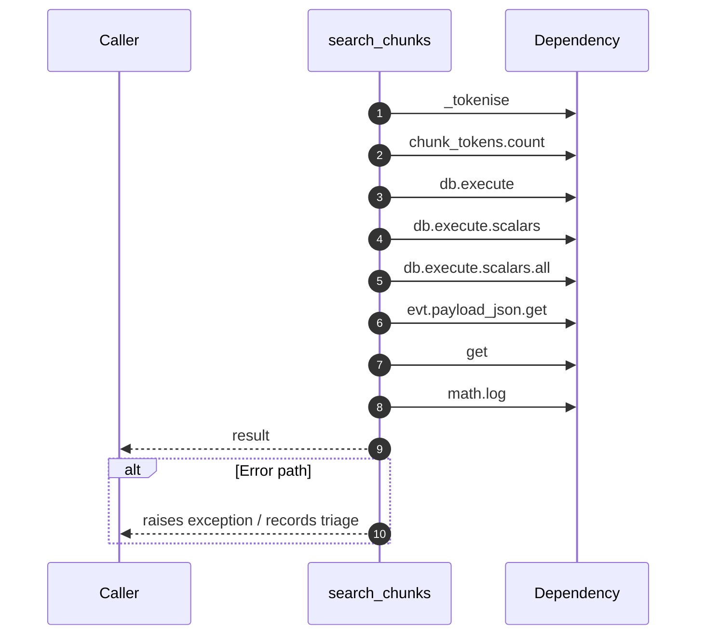

# Internal flow — `app.application.local_kb.search_chunks`

- Module: `app.application.local_kb`
- Source: [app.application.local_kb.search_chunks](../Src/backend/app/application/local_kb.py#L90)
- Summary: Retrieve chunks via simple keyword scoring for fallback responses.

