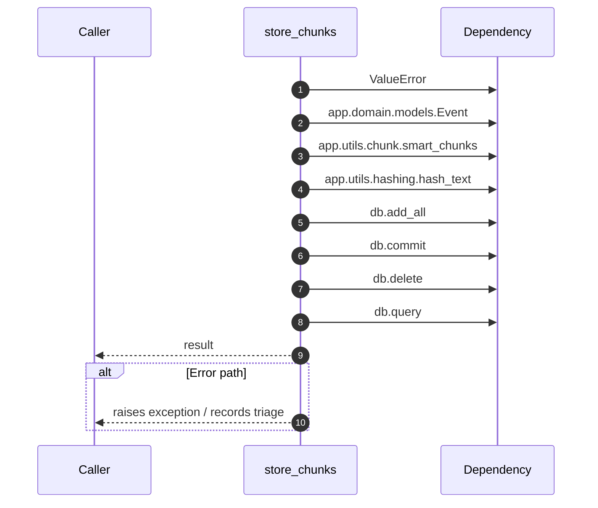

# Internal flow — `app.application.local_kb.store_chunks`

- Module: `app.application.local_kb`
- Source: [app.application.local_kb.store_chunks](../Src/backend/app/application/local_kb.py#L24)
- Summary: Persist document chunks into the ``event`` table for fallback retrieval.

