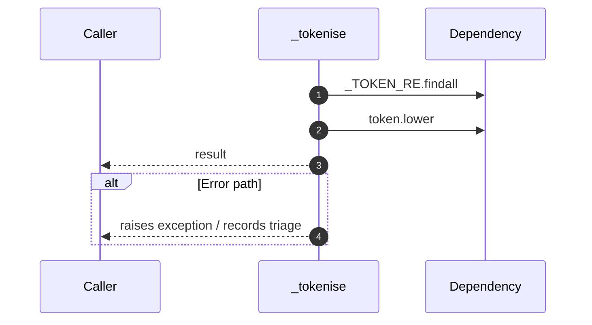

# Internal flow — `app.application.local_kb._tokenise`

- Module: `app.application.local_kb`
- Source: [app.application.local_kb._tokenise](../Src/backend/app/application/local_kb.py#L20)

```mermaid
sequenceDiagram
    autonumber
    participant Caller
    participant Target as _tokenise
    Target->>Dependency: _TOKEN_RE.findall
    Target->>Dependency: token.lower
    Target-->>Caller: result
    alt Error path
        Target-->>Caller: raises exception / records triage
    end
```