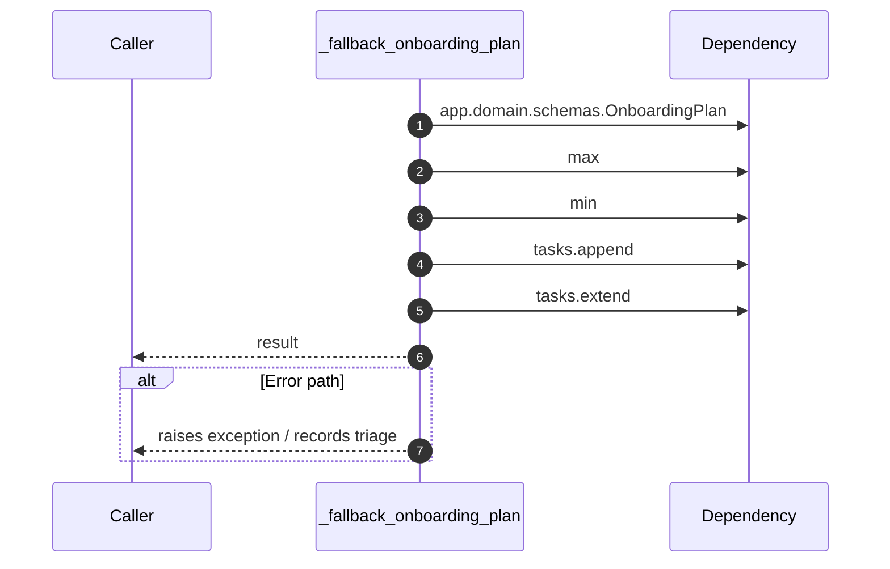

# Internal flow — `app.application.onboarding_service._fallback_onboarding_plan`

- Module: `app.application.onboarding_service`
- Source: [app.application.onboarding_service._fallback_onboarding_plan](../Src/backend/app/application/onboarding_service.py#L80)
- Summary: Produce a deterministic onboarding plan when the planner is unavailable.

