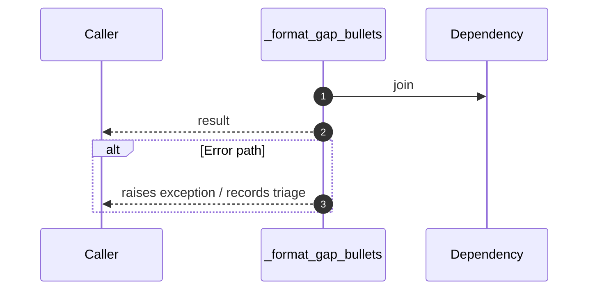

# Internal flow — `app.application.onboarding_service._format_gap_bullets`

- Module: `app.application.onboarding_service`
- Source: [app.application.onboarding_service._format_gap_bullets](../Src/backend/app/application/onboarding_service.py#L15)
- Summary: Return markdown bullet list of the top gaps.

